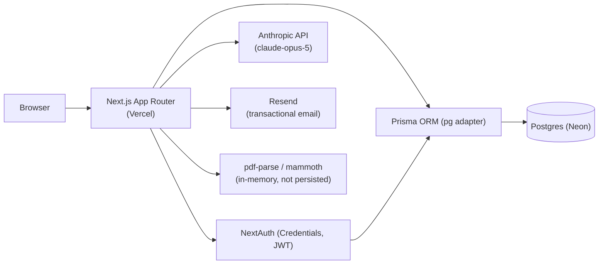

# Architecture

Current state: all four roadmap phases are built (master profile, resume
builder + templates + PDF export, resume upload/parsing, AI features,
application tracking) plus a batch of hardening/gap-closure work (rate
limiting, input length caps, email verification, account lockout, account
settings/deletion/export, cover letter editing, resume/application
search, dashboard stats, manual reordering). See [FEATURES.md](../FEATURES.md)
and [PROJECT_STATUS.md](../PROJECT_STATUS.md) for the authoritative,
continuously-updated status and test evidence per feature — this file
describes the shape of the system, not feature-by-feature status.

Known blockers: `ANTHROPIC_API_KEY` and `RESEND_API_KEY` aren't set in
production yet, so AI features and real email delivery are code-complete
but unverified live. Phone/OTP verification (MSG91) is blocked on DLT
registration and not wired into signup/login. Dev/Preview/Production
still share one Neon database (see [DATABASE.md](../DATABASE.md)).

## Frontend architecture

- Next.js App Router (`app/`), TypeScript, Tailwind CSS v4 (CSS variables
  in `app/globals.css`, exposed via `@theme inline`; see
  [UI_DESIGN.md](./UI_DESIGN.md)).
- Client-side auth state via `next-auth/react`'s `SessionProvider`
  (`components/Providers.tsx`, wired into `app/layout.tsx`).
- No state management library beyond React itself and NextAuth's session.
  Every data-bearing page follows the same pattern: a server component
  (`page.tsx`) does the `getServerSession` auth check and redirect, then
  renders a `"use client"` component that fetches from the route's own
  API and manages its own local state.
- Pages:
  - `/` — landing page (`Hero`, `Roadmap`, `SiteHeader`, `SiteFooter`)
  - `/signup`, `/login`, `/forgot-password`, `/reset-password`,
    `/verify-email` — auth flows
  - `/dashboard` — protected home; summary stats computed with direct
    Prisma queries in the server component, links to everything else
  - `/profile`, `/profile/import` — master profile editor, resume
    import (PDF/DOCX)
  - `/resumes`, `/resumes/[id]`, `/resumes/[id]/preview` — resume list,
    editor (+ AI tools), print/PDF-export preview
  - `/applications` — application tracker
  - `/account` — account settings, data export, account deletion
  - `/verify-phone` — standalone MSG91 OTP test page, not wired into
    signup/login (blocked, see above)
- Shared editing UI: `components/profile/{ExperienceForm,
  ExperienceSection, EducationForm, EducationSection, SkillsSection,
  types}.tsx` implement one experience/education/skills list-and-form UI,
  parameterized by an `apiBase` prop, reused by both the master profile
  editor (`components/ProfileEditor.tsx`, `apiBase="/api/profile"`) and
  every resume editor (`components/ResumeEditor.tsx`,
  `apiBase="/api/resumes/:id"`) rather than duplicated per surface.

## Backend architecture

Next.js Route Handlers under `app/api/`, grouped by resource:

- `app/api/auth/` — `[...nextauth]` (NextAuth), `signup`,
  `forgot-password`, `reset-password`, `verify-email`,
  `resend-verification`
- `app/api/account/` — account info/name (`GET`/`PATCH`), deletion
  (`DELETE`), `password` (change password), `export` (data export)
- `app/api/profile/` — basic info (`GET`/`PUT`), `experience/[id]`,
  `education/[id]`, `skills/[id]`, `parse-resume` (upload/parse only,
  no DB write)
- `app/api/resumes/` — list/create (`GET`/`POST`), `[id]`
  (`GET`/`PATCH`/`DELETE`), and per-resume `experience/[expId]`,
  `education/[eduId]`, `skills/[skillId]`, plus the AI-backed
  `optimize`, `ats-check`, `match`, `cover-letters/[letterId]`
- `app/api/applications/` — list/create (`GET`/`POST`),
  `[id]` (`PATCH`/`DELETE`)
- `app/api/otp/` — `send`, `verify` (MSG91, not wired into auth; blocked)

Every route under `/api/profile`, `/api/resumes`, `/api/applications`,
and `/api/account` requires a session and scopes its query to
`session.user.id`; ownership of nested resources (e.g. one experience
entry, one cover letter) is checked via a relation filter back to the
owning user, never trusted from the request. See
[API.md](../API.md) for the full per-endpoint reference and
[SECURITY.md](./SECURITY.md) for the authorization model.

Shared server-side logic lives in `lib/`:

- `lib/prisma.ts` — Prisma Client singleton (pg driver adapter)
- `lib/auth.ts` — NextAuth config; credentials `authorize` also enforces
  the login rate limit and account lockout
- `lib/rateLimit.ts` — Postgres-backed fixed-window rate limiter
  (`RateLimitBucket`), used because Vercel serverless functions don't
  share memory across invocations, so an in-memory limiter wouldn't work
- `lib/textLimits.ts` — shared max-length constants + validator for
  free-text input
- `lib/email.ts`, `lib/emailVerification.ts` — Resend wrapper (with a
  dev-mode console fallback when `RESEND_API_KEY` is unset) and
  verification-token issuing, shared by signup and resend-verification
- `lib/profile.ts`, `lib/resumeAccess.ts` — get-or-create profile,
  ownership-checked resume-with-nested-items query, both reused across
  several routes instead of duplicating the query
- `lib/experience.ts`, `lib/education.ts` — shared create/update
  validation for experience/education entries, used by both the
  profile routes and the resume routes (identical shape, different
  parent table)
- `lib/resumeText.ts` — formats a resume's data into prompt text for
  the AI routes
- `lib/ai.ts` — Anthropic SDK wrapper; see [AI.md](./AI.md)
- `lib/resumeParse.ts` — PDF/DOCX text extraction + heuristic resume
  parsing; see [FILE_PROCESSING.md](./FILE_PROCESSING.md)
- `lib/msg91.ts` — MSG91 OTP send/verify (blocked, not wired in)

## Database architecture

Prisma ORM, Postgres hosted on Neon (see
[prisma/schema.prisma](../prisma/schema.prisma)), via `@prisma/adapter-pg`
(driver adapter required by Prisma 7; see [lib/prisma.ts](../lib/prisma.ts)).
Full details, including the shared-database-across-environments caveat,
in [DATABASE.md](../DATABASE.md). Models:

- `User`, `PasswordResetToken`, `EmailVerificationToken` — auth; `User`
  also carries `failedLoginAttempts`/`lockedUntil` for account lockout
- `Profile`, `Experience`, `Education`, `Skill` — master profile, one
  `Profile` per `User`
- `Resume`, `ResumeExperience`, `ResumeEducation`, `ResumeSkill`,
  `CoverLetter` — a resume snapshots the profile's data at creation
  time into its own rows (not a live reference), so it can be edited
  independently per application; `Resume.template` selects the preview
  layout ("classic" | "compact")
- `Application`, `ApplicationStatus` (enum) — job applications;
  optionally links to one `Resume` and one `CoverLetter`
  (`onDelete: SetNull` on both — deleting the linked resume/letter
  unlinks the application rather than deleting it)
- `RateLimitBucket` — rate limiter storage (see above)

`Experience`, `Education`, `ResumeExperience`, `ResumeEducation` all carry
a `sortOrder` column for manual reordering (new entries append at the
end; entries are otherwise unordered relative to date).

## Authentication

NextAuth (Auth.js v4), Credentials provider (email+password), JWT
session strategy. Config in [lib/auth.ts](../lib/auth.ts). Passwords are
bcrypt-hashed (10 rounds). Login attempts are rate-limited (10/15 min per
email) and separately tracked for account lockout (10 cumulative failures
locks the account for 1 hour, independent of the rate-limit window — see
[SECURITY.md](./SECURITY.md)).

## AI architecture

Implemented — see [AI.md](./AI.md) for the model, prompts, and cost
controls.

## File processing

Implemented — see [FILE_PROCESSING.md](./FILE_PROCESSING.md) for the
upload/parse pipeline.

## API architecture

Route Handlers under `app/api/`, documented per-endpoint in
[API.md](../API.md). No API versioning. Rate limiting is applied
selectively (auth endpoints with abuse/cost exposure, all four AI
routes) rather than globally — see [SECURITY.md](./SECURITY.md).

## Security architecture

Password hashing, JWT sessions, per-resource ownership checks, rate
limiting, account lockout, and input length caps are all implemented.
CSRF protection beyond NextAuth's built-in cookie-based protections has
not been separately added (not needed for session-cookie-authenticated
JSON APIs called from the same origin). Full details:
[SECURITY.md](./SECURITY.md).

## Component architecture

- Landing page: `SiteHeader`, `Hero`, `Roadmap`, `SiteFooter`
- Session: `Providers`, `SignOutButton`
- Master profile / resume editing (shared): `ProfileEditor`,
  `ResumeEditor`, `components/profile/*` (see Frontend architecture above)
- Resume-specific: `ResumeList`, `ResumePreview` (both templates),
  `ResumeImport` (PDF/DOCX upload), `ResumeAITools` (optimize/ATS/match/
  cover letters)
- Applications: `ApplicationsList`
- Account: `AccountSettings`

## Diagram (current state)

`ANTHROPIC_API_KEY` and `RESEND_API_KEY` are not set in production yet
(see the top of this file) — those two integrations are wired up in code
but not live for real users until the keys are added.
