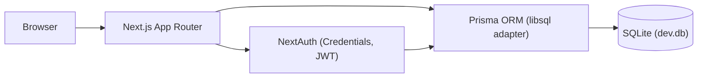

# Architecture

Current state: landing page + authentication are built and tested. This
document describes what exists today plus the intended shape; sections
marked "(planned)" are not built.

## Frontend architecture

- Next.js App Router (`app/`), TypeScript, Tailwind CSS.
- Pages: `/` (landing), `/login`, `/signup`, `/dashboard` (protected).
- Client-side auth state via `next-auth/react`'s `SessionProvider`
  (`components/Providers.tsx`, wired into `app/layout.tsx`).
- No state management library beyond React itself and NextAuth's session.

## Backend architecture

- Next.js Route Handlers under `app/api/`:
  - `app/api/auth/[...nextauth]/route.ts` — NextAuth (login/session/signout)
  - `app/api/auth/signup/route.ts` — account creation
- See [API.md](../API.md).

## Database architecture

- Prisma ORM, SQLite for local dev (see [prisma/schema.prisma](../prisma/schema.prisma)).
- `User` model with `passwordHash` for credentials auth. See [DATABASE.md](../DATABASE.md).
- Prisma 7's client requires a driver adapter at runtime; this project uses
  `@prisma/adapter-libsql` (see [lib/prisma.ts](../lib/prisma.ts)) since it
  needs no native compiler, unlike `better-sqlite3`.

## Authentication

NextAuth (Auth.js v4), Credentials provider (email+password), JWT session
strategy. Config in [lib/auth.ts](../lib/auth.ts). See
[SECURITY.md](./SECURITY.md) for the security details.

## File processing (planned)

Not implemented. See [FILE_PROCESSING.md](./FILE_PROCESSING.md).

## AI architecture (planned)

Not implemented. See [AI.md](./AI.md).

## API architecture

Route Handlers under `app/api/`, documented per-endpoint in
[API.md](../API.md). No API versioning or rate limiting yet.

## Security architecture

Password hashing (bcrypt) and JWT sessions are implemented; authorization,
rate limiting, and CSRF beyond NextAuth's built-in protections are not. See
[SECURITY.md](./SECURITY.md).

## Component architecture

`components/`: `SiteHeader`, `Hero`, `Roadmap`, `SiteFooter` (landing page),
`Providers` (session context), `SignOutButton`.

## Diagram (current state)

Everything beyond this — master profile, resume builder, AI calls, file
processing — is not yet built.
