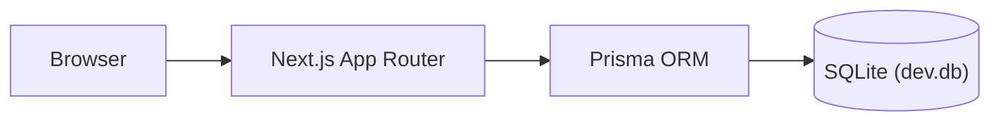

# Architecture

Current state: scaffold only. This document describes what exists today plus
the intended shape; sections marked "(planned)" are not built.

## Frontend architecture

- Next.js App Router (`app/`), TypeScript, Tailwind CSS.
- No component library or state management chosen yet beyond React itself.

## Backend architecture

- Next.js Route Handlers under `app/api/` (planned) — none exist yet.

## Database architecture

- Prisma ORM, SQLite for local dev (see [prisma/schema.prisma](../prisma/schema.prisma)).
- Single placeholder `User` model. See [DATABASE.md](../DATABASE.md).

## Authentication (planned)

Not implemented. No provider chosen yet.

## File processing (planned)

Not implemented. See [FILE_PROCESSING.md](./FILE_PROCESSING.md).

## AI architecture (planned)

Not implemented. See [AI.md](./AI.md).

## API architecture (planned)

Not implemented. See [API.md](../API.md).

## Security architecture (planned)

Not implemented. See [SECURITY.md](./SECURITY.md).

## Component architecture

`components/` exists and is currently empty.

## Diagram (current state)

Everything beyond this — auth, AI calls, file processing, external APIs — is
not yet built.
